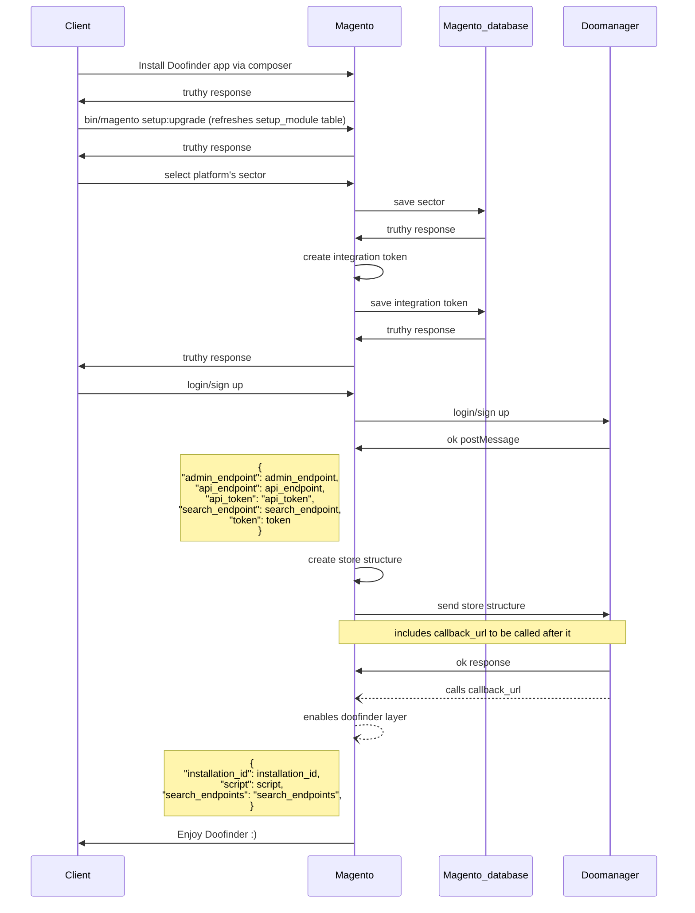
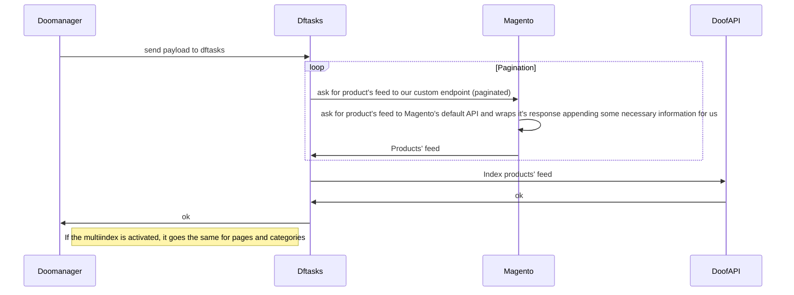
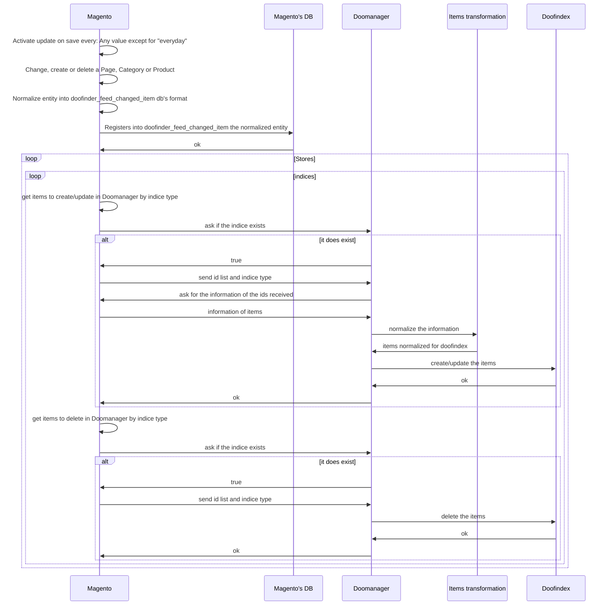

# Magento Architecture & Diagrams

## Relevant information

* Doofinder module is ALWAYS installed via composer. 
* Magento creates a store in Doofinder per store group. It registers its website's id information inside its corresponding's store's options in order to get the correct products in the feed for the search engines corresponding to the store_views from that website.
* It also stores its store view's id into the datasource options with the same goal as above, but more accurately.
* If the Magento app is uninstalled then the associated Doofinder store is NOT deleted, neither its search engines nor indices.

## Diagrams

### Install Doofinder plugin from Magento

### Index Magento feed 

### Update on save process
